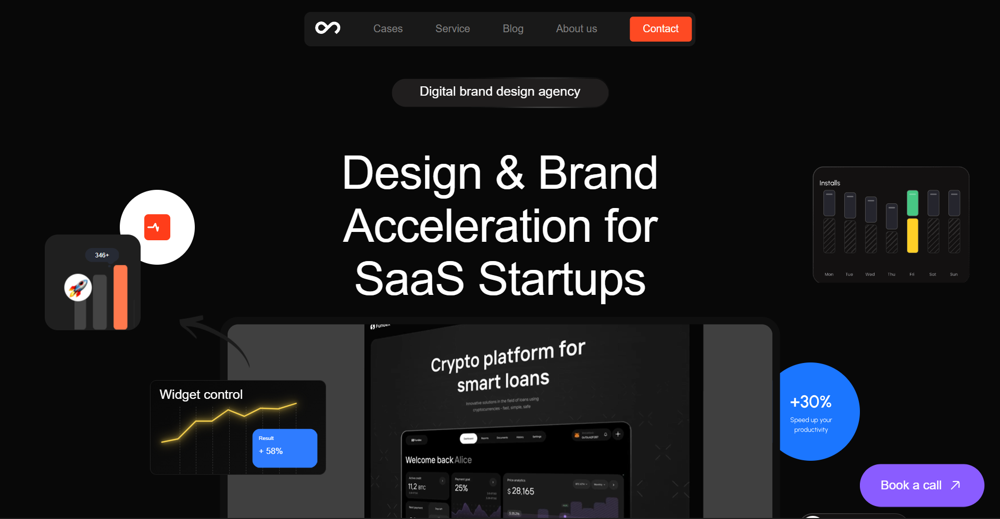

# Outcrowd Clone

A modern landing page inspired by **Outcrowd** recreated as a personal front-end practice project.

The main goal of this project was to challenge myself to improve my UI development skills, and understand how modern agency websites are built using only HTML5, CSS3, and JavaScript.

> **Disclaimer:**
> This project is created for educational and practice purposes only.
> All original design and Img credits belong to Outcrowd.

---

## Live Demo

 https://clone-outcrowd.vercel.app/

---

## Screenshots

### Website View



---

## Features

* Modern landing page layout
* Smooth animations and transitions
* Interactive hover effects
* Pure vanilla JavaScript
* Scroll-based interactions

---

## Tech Stack

| Technology | Usage                |
| ---------- | -------------------  |
| HTML5      | Page structure       |
| CSS3       | Styling & animations |
| JavaScript | User interactions    |
| Git        | To update code       |
| GitHub     | Source code hosting  |
| Vercel     | Deployment           |

---

## Project Structure

```bash
outcrowd-clone
│
├── index.html
├── style.css
├── script.js
│
├── assets
│   ├── images
│   ├── icons
│   ├── videos
│   └── screenshots
│
└── README.md
```


## Getting Started

### Clone the repository

```bash
git clone https://github.com/itsketangupta/landing_page_dumy.git
```

### Move into the project directory

```bash
cd landing_page
```

### Run locally

Simply open:

```bash
index.html
```

Or use:

* VS Code Live Server
* Live Server Extension

---

## Goals of This Project

* Practice responsive web design
* Improve CSS architecture
* Build cleaner JavaScript code
* Understand professional landing page layouts
* Develop better design consistency
* Experiment with animations and transitions

---

## Things I Learned

During this project, I learned:

* Animation timing principles
* Organizing larger CSS files
* Writing maintainable JavaScript
* Structuring Front-End projects properly

---

## Challenges Faced

Some interesting challenges while building this project:

* Matching modern design aesthetics
* Makeing smooth website 
* Managing spacing consistency

---

## Performance Goals

The project aims to achieve:

* Make fast loding project.
* Efficient JavaScript usage
* Optimized image assets
* Clean semantic HTML

---

## Inspiration

I enjoy cloneing modern websites becauz they help me how real website looks like:

* Real-world design systems
* Professional UI patterns
* Better coding practices

This project is one step in that learning journey.

---

## Why I Made This

I believe the best way to improve as a front-end developer is by building things and coleing website.

This project is part of my journey to became a better developer.

---

## Support

If you liked this project give it a star on GitHub.

It motivates me to build more projects and continue learning.

---

## Copyright & License

This repository is intended for educational and non-commercial use only.

Original inspiration belongs to Outcrowd and its creators.

---

## Maker of this clone Website 

**Ketan Gupta**

Thank u for read my readme.